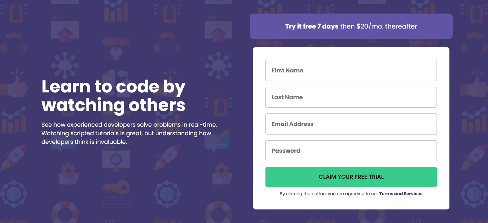

# Frontend Mentor - Intro component with sign up form solution

This is a solution to the [Intro component with sign up form challenge on Frontend Mentor](https://www.frontendmentor.io/challenges/intro-component-with-signup-form-5cf91bd49edda32581d28fd1). Frontend Mentor challenges help you improve your coding skills by building realistic projects.

## Table of contents

- [Overview](#overview)
  - [The challenge](#the-challenge)
  - [Screenshot](#screenshot)
  - [Links](#links)
- [My process](#my-process)
  - [Built with](#built-with)
  - [What I learned](#what-i-learned)
  - [Continued development](#continued-development)
  - [Useful resources](#useful-resources)
- [Author](#author)
- [Acknowledgments](#acknowledgments)

## Overview

### The challenge

Users should be able to:

- View the optimal layout for the site depending on their device's screen size
- See hover states for all interactive elements on the page
- Receive an error message when the `form` is submitted if:
  - Any `input` field is empty. The message for this error should say _"[Field Name] cannot be empty"_
  - The email address is not formatted correctly (i.e. a correct email address should have this structure: `name@host.tld`). The message for this error should say _"Looks like this is not an email"_

### Screenshot

### Links

- Solution URL: [Frontend Mentor](https://www.frontendmentor.io/solutions/responsive-signup-form-using-html-css-and-javascript-ExMYkVfr1o)
- Live Site URL: [Github Pages](https://bccpadge.github.io/intro-component-with-sign-up-form/)

## My process

### Built with

  
  
  

### Continued development

I want to continue to implement accessibility in my future projects.

### Useful resources

- [Id attribute](https://fedmentor.dev/posts/id-attribute-masterclass/) - Great article explaining when to use the id attribute
- [Coolors Constrast Checker](https://coolors.co/contrast-checker) - Check color constrast between text color and background colors

## Author

  
  
  
  

## Acknowledgments

- [JavaScript implementation](https://www.youtube.com/watch?v=HD4qiSU1CBQ)
